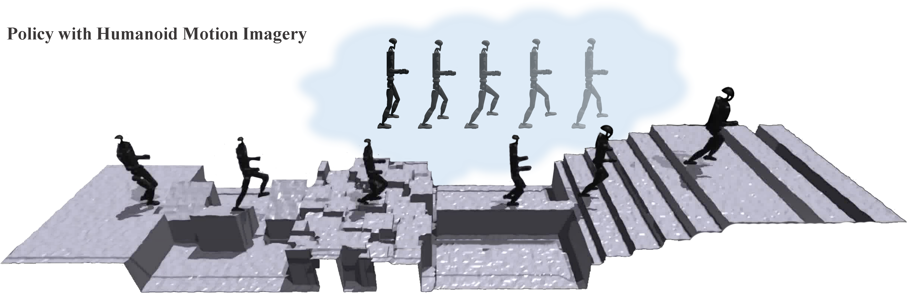

# [Humanoid Terrain Bench](https://github.com/shiki-ta/Humanoid-Terrain-Bench/tree/master)




### Installation ###
```bash
conda create -n terrain python=3.8
conda activate terrain
cd
pip install torch torchvision torchaudio --index-url https://download.pytorch.org/whl/cu118   #or cu113,cu115,cu121, based on your cuda version

git clone https://github.com/shiki-ta/Humanoid-Terrain-Bench.git
cd Humanoid-Terrain-Bench
# Download the Isaac Gym binaries from https://developer.nvidia.com/isaac-gym 
cd isaacgym/python && pip install -e .
cd ~/Humanoid-Terrain-Bench/rsl_rl && pip install -e .
cd ~/Humanoid-Terrain-Bench/legged_gym && pip install -e .
cd ~/Humanoid-Terrain-Bench/challenging_terrain && pip install -e .
pip install "numpy<1.24" pydelatin wandb tqdm opencv-python ipdb pyfqmr flask
```

### Usage ###
`cd legged_gym/scripts`
1. Train base policy:  
```
python train.py --exptid h1-2 --device cuda:0 --headless --task h1_2_fix
```

2. Training Recovery:
```
python train.py --exptid h1-2 --device cuda:0 --resume --resumeid=test --checkpoint=50000 --headless --task h1_2_fix
```

3. Play base policy:
```
python play.py --exptid test --task h1_2_fix
```

4. record trace as dataset

```
python record_replay.py --exptid test --save
```

### Arguments ###
- --exptid: string,  to describe the run. 
- --device: can be `cuda:0`, `cpu`, etc.
- --checkpoint: the specific checkpoint you want to load. If not specified load the latest one.
- --resume: resume from another checkpoint, used together with `--resumeid`.
- --seed: random seed.
- --no_wandb: no wandb logging.
- --save: make dataset

### acknowledgement ###

[legged_gym](https://github.com/shiki-ta/Humanoid-Terrain-Bench/tree/master)

[Isaac Gym](https://junxnone.github.io/isaacgymdocs/index.html)

[extreme parkour](https://github.com/chengxuxin/extreme-parkour)
